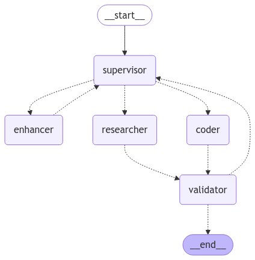

# A LangGraph-based Multi-Agent System

A simplified demonstration of a LangGraph-based API powered by FastAPI and Groq's language model. This project showcases a workflow where a supervisor routes user queries to a researcher (for information gathering) or a coder (for technical tasks), defined by system prompts, leveraging Llama3.3 or Mixtral to process and respond to requests. Agents are autonomously equipped with Tavily tools. Enhanced with the ORJSONResponse class, the FastAPI response speed improves by 20-25%.

## Table of Contents
- [Overview](#overview)
- [Features](#features)
- [Requirements](#requirements)
- [Installation](#installation)

## Overview
The Multi Agent API is a lightweight implementation of a task-routing system using LangGraph and FastAPI. It integrates Groq's `llama-3.1-8b-instant` model for natural language processing and Tavily for search capabilities. The system analyzes user input, delegates tasks to appropriate agents (researcher or coder), and returns structured responses.

This project is designed as a proof-of-concept and can be extended for more complex workflows or additional tools.

## Features
- **Task Routing**: A supervisor agent determines whether a query requires research, coding, or is already answerable.
- **Structured Responses**: Responses are returned in a consistent JSON format with workflow steps and timestamps.
- **FastAPI Integration**: Provides a modern, asynchronous API framework with automatic OpenAPI documentation.
- **Modular Design**: Built with LangGraph for easy extension of nodes and workflows.
- **Environment Configuration**: Uses `.env` files for secure API key management.

## Requirements
- Python 3.11
- FastAPI
- LangChain (with Groq and community tools)
- Pydantic
- Uvicorn
- Tavily API (optional, for search functionality)
- Groq API Key

## comman to run the application 

uvicorn agent:app --reload

## How to Use the API
FastAPI automatically generates interactive API documentation. This is the easiest way to test the endpoint.
Open your browser and navigate to http://127.0.0.1:8000/docs.
You will see the Swagger UI documentation. Find the /chat/ endpoint and expand it.
Click the "Try it out" button.
In the message field, type your query.
Example for the Researcher: What is the capital of France?
Example for the Coder: write a python function to find the nth fibonacci number
Click the "Execute" button.
